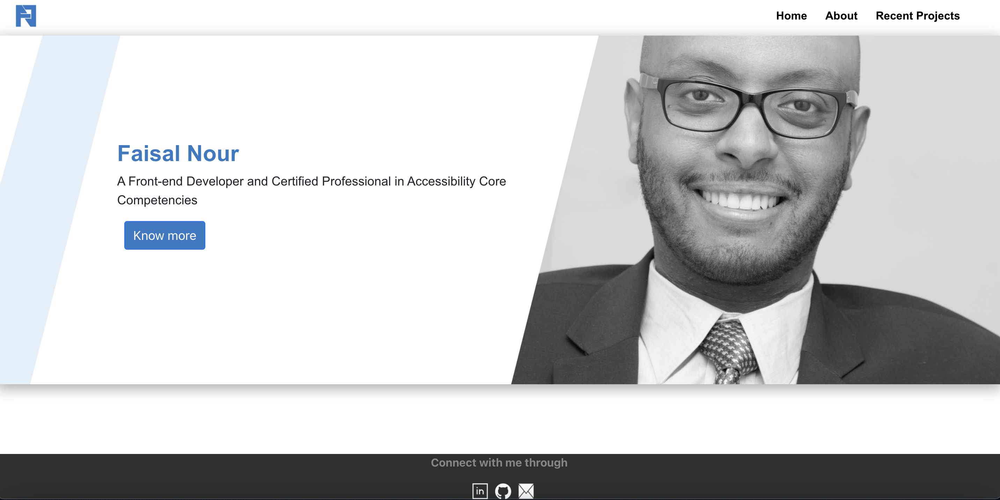
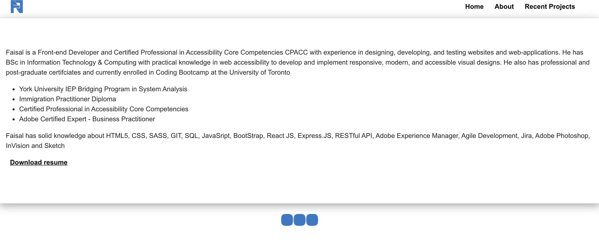
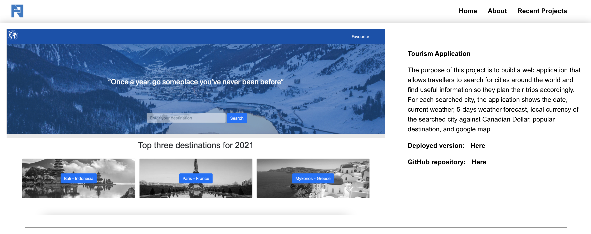

# React Portfolio

## The purpose:

A porfolio website built using React to demonstrate the qualifications, projects and technical skills I have as a Front-end Developer.

## Features:

The website displays the following:

1. A brief description of qualification, experience and certificates.
2. List of recent project built individually or as a group.
3. Contact information such as email and phone number, and links to LinkedIn and Github profile.

## Screenshots:

The following pictures show the web application's appearance and functionality:

## Live URL of the deployed application:

[Click here](https://faisalnour.com/)
